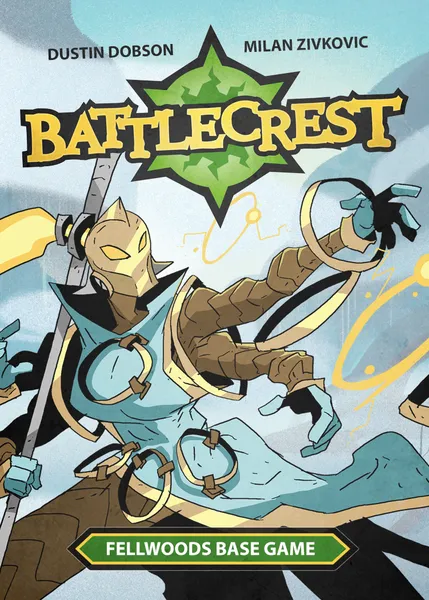
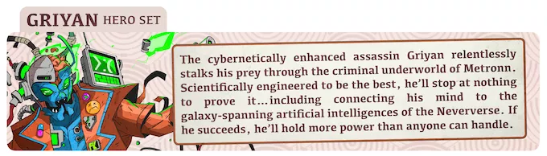
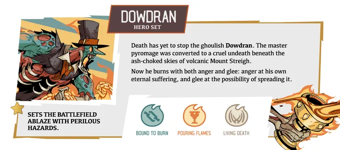

## Battlecrest

</img>

[Battlecrest](https://boardgamegeek.com/boardgame/339532/battlecrest-fellwoods-base-game) est un jeu d'affrontement tactique pour 2 joueurs, créé par Dustin Dobson et Milan Zivkovic. Il est édité par [Button Shy Games](https://buttonshygames.com/products/battlecrest).

Il se joue avec 18 cartes : 6 qui représentent le terrain et 6 pour chaque personnage. L'absence de hasard rend le jeu très stratégique. Le terrain dynamique et les "crests" qui donnent leur nom au jeu lui ajoutent une dimension tactique et 
beaucoup de rejouabilité.

C'est le premier jeu auquel j'ai contribué en tant que designer, autrement qu'en amateur, en créant des personnages et des mécaniques pour le mode solo du jeu.

Voici les personnages que j'ai créés :

</img>
- [Griyan](https://boardgamegeek.com/boardgameexpansion/400056/battlecrest-griyan-hero-set) un assassin impitoyable, prêt à tout pour prouver sa valeur, quitte à fusionner avec une IA à l'échelle galactique.

</img>
- [Dowdran](https://boardgamegeek.com/boardgameexpansion/434911/battlecrest-expansion-collection-5) un zombie enflammé qui rôde des le desert de Daedrock, à la recherche de victimes auxquelles transmettre sa malédiction
- Caera, une entité qui manipule le temps, qui sortira en 2026

J'ai aussi participé à la création de fiches de comportement de personnages pour le mode solo du jeu, notamment pour les personnages de l'extension [Battlecrest: Expansion Collection 4](https://boardgamegeek.com/boardgameexpansion/434910/battlecrest-expansion-collection-4). Mais aussi au set de 6 cartes qui composent le mode solo de la saison 3, l'imperator 3 présent dans la même extension que Dowdran.
